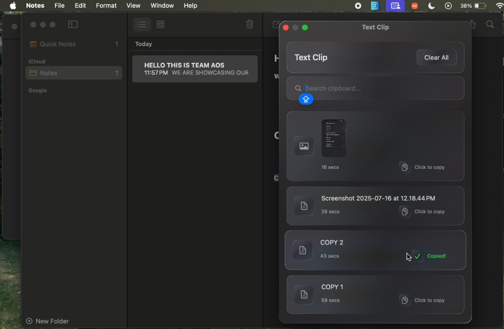
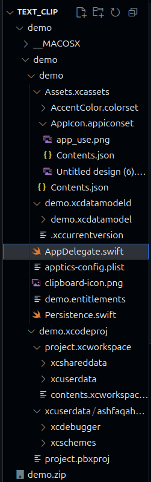

# Text Clip – Minimal Clipboard Manager for macOS

**Text Clip** is a minimal, easy-to-use clipboard manager for macOS, built using **Swift** and **SwiftUI**, and featuring the **Liquid Glass interface** introduced in Apple's WWDC25.  
It lets you store multiple text and image clips for quick access—right from your menu bar.

---

## ✨ Features
- 📋 Store multiple clipboard entries (text & images)  
- 🪟 Transparent, “Liquid Glass” background for modern macOS aesthetics  
- 🔍 Search your saved clips easily  
- 🖱️ Paste by simply clicking an entry  
- 🛠 Minimal and distraction-free design

---

## 📸 Screenshot
Here’s **Text Clip** in action:

---

## 🚀 Getting Started

### Option 1 – Using the Demo Folder
1. Navigate to the `demo` folder in the repository.  
2. Refer to the project directory layout below to identify the correct file to run:  

     

3. Open `AppDelegate.swift` in **Xcode**.  
4. Run the project.  
5. The **Text Clip** icon should now appear in your macOS menu bar (top right).

### Option 2 – From ZIP
1. Download and extract the `.zip` from the releases or repository.  
2. Refer to the project directory layout above if needed.  
3. Open the extracted folder in **Xcode**.  
4. Run `AppDelegate.swift` as above.

---

## 💡 Note on macOS Compatibility
- **macOS 26** is set to introduce a built-in clipboard manager.
- If you’re on **macOS 25 or earlier**, **Text Clip** is the perfect lightweight alternative.
- Developers are welcome to contribute improvements or create a version that **launches automatically at boot**.

---

## 🤝 Contributing
We welcome:
- Startup-on-boot functionality  
- Additional productivity features  
- UI/UX improvements  
- Performance optimizations  

To contribute:
1. Fork the repo.
2. Create a feature branch.
3. Submit a pull request.

---

## 👥 Credits
This project was built by:
- **[@Shreshtha-Kumar](https://github.com/Shreshtha-Kumar)**   
- **[@OMKAR-COD636](https://github.com/OMKAR-COD636)** 
- **[@ash1234-dj](https://github.com/ash1234-dj)** 

💬 Check out my teammates’ GitHubs for other cool stuff they might build in the future!

---

## 📜 License
This project is licensed under the terms of the [GNU General Public License v3.0](LICENSE).